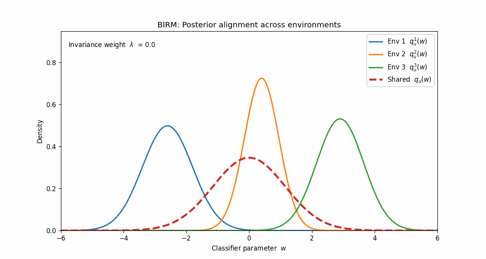

  
   
  
  
  

 

  
  
  
  
  
  
  
  
  

 

  <a href="https://t.me/dxyzsem">Telegram</a> •
  <a href="mailto:d.semenov7@g.nsu.ru">Email</a>

 

---

  
<b>More</b>

   

  - I currently work as a **Technical Product Manager**.
   
  - I study and research **AI/DS** at **FIT NSU**.
  
  - Main interest: **Machine Learning -> Bayesian Invariant Risk Minimization (BIRM)**

---

**BIRM - posterior alignment across environments (conceptual illustration)**  

Solid curves depict environment-wise variational posteriors $q_u^{e}(w)$ over a classifier parameter $w$ (one per environment), while the dashed curve depicts the shared posterior $q_u(w)$ inferred across training environments. 

The animation varies the invariance weight $\lambda$ to visualize the intended effect in BIRM: reducing mismatch between $q_u^{e}(w)$ and $q_u(w)$ during optimization. 

**Paper:** [Lin et al., CVPR 2022](https://openaccess.thecvf.com/content/CVPR2022/supplemental/Lin_Bayesian_Invariant_Risk_CVPR_2022_supplemental.pdf)

  

  

---
